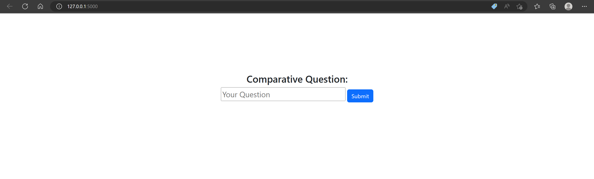
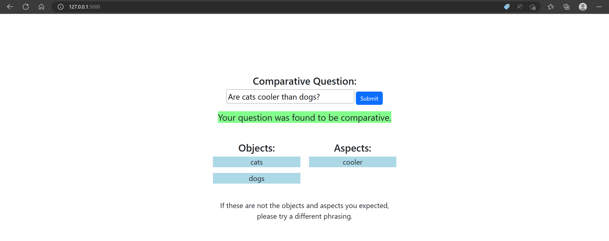
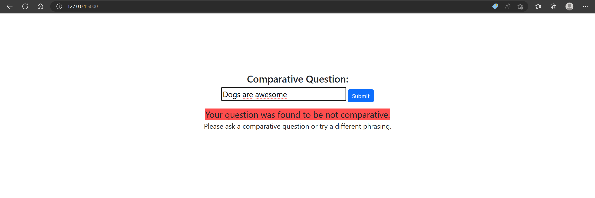

# CAM-NLU
A module/extension to extract objects and aspects from natural language.

## Introduction

This Project aims to provide CAM (Comparative Argumentative Machine, Language Techonology Group, UHH)
with the ability to understand natural language. The goal is that CAM can extract objects and aspects of a comparative question
and tell if a question is not comparative. 

## Technologies

This project uses the following technologies:   
-Python 3.10.9   
-spaCy 3.5.0  
-flask 2.2.2  
-Bootstrap 5.3.0-alpha1  
-waitress 2.1.2  
-miniconda3   

## Installation

It is possible to deploy the CAM-NLU web app in two ways: With Docker and without Docker.

### Installation with Docker

1) Install [Docker](https://docs.docker.com/install/)  
2) Pull the dersibbe/cam-nlu-unit image from [Docker Hub](https://hub.docker.com):  
    ```shell script
    docker pull dersibbe/cam-nlu-unit
    ```
3) Run a container with the cam-nlu-unit image:  
    ```shell script
    docker run -p 5000:5000 -d dersibbe/cam-nlu-unit
    ```
4) Open `localhost:5000` in your browser.  
The CAM-NLU web app should now be running.  
  

### Installation without Docker: 

1) Clone the CAM-NLU git repository to your machine
    ```shell script
    git clone https://github.com/Norzhan/aiapps_CAM-NLU.git
    ```
2) Install [miniconda3](https://docs.conda.io/en/latest/miniconda.html) 

3) Open the anaconda prompt and move to the repositories directory  

4) Use the following command to create the environment:
    ```shell script  
    conda env create -f aiapps_environment.yml  
    ```

5) Activate the environment:
    ```shell script  
    conda activate aiapps  
    ``` 

6) Get the spaCy model:
    ```shell script  
    python -m spacy download en_core_web_sm  
    ```

7) Move to the aiapps_website folder and run `serv.py`:
    ```shell script  
    cd aiapps_website  
    python serv.py  
    ```

A new tab of your default browser should open at the address: http://127.0.0.1:5000/


## Architecture 

The program is started with the serv.py file. This file uses flask and waitress to provide a user interface at localhost:5000. 
serv.py imports the class Extractor, located in the file CAM_NLU.py and uses two of its functions, extract_comparative and check_comparative. 
The web app expects a text input in the input field. Hitting `ENTER` will forward the input text to an `Extractor` object. Its method `check_comparative()` then checks if the input sentence is a comparative sentence, and if it is, `extract_comparative()` attempts to extract compared objects and aspects from the input sentence. `extract_comparative()` also reverts the judgement of `check_comparative()` if it fails to find at least two objects in the input sentence.  
  
As of now, both of these methods work primarily based on heuristics. `check_comparative()` returns `True` if the input sentence contains either one or multiple of the words "or", "and" and "than", surrounded by spaces. `extract_comparative()` then analyses the structure of the sentence, assuming it to be any of the following four, or close varaitions:  
  
- "Which is `ASPECT`: `OBJ1` or `OBJ2`?"  
- "Is `OBJ1` `ASPECT` than `OBJ2`?"*  
- "Is `OBJ1` or `OBJ2` `ASPECT`?"*  
- "What's the difference between `OBJ1` and `OBJ2`?"  
  
*these cases are based most heavily on spaCy's dependency trees and are most likely to take on its inaccuracies.  
  
Inputting a comparative question, e.g. "Are cats cooler than dogs?", will render the `results.html` template with the extracted objects and aspects displayed under a green highlighted text confirming that the input was a comparative sentence:  
  
  
If the `Extractor` does not recognize the input text as a comparative question, the template `non-comparative.html` will be rendered, showing a red highlighted text saying that the input text was found not to be a comparative sentence:  
